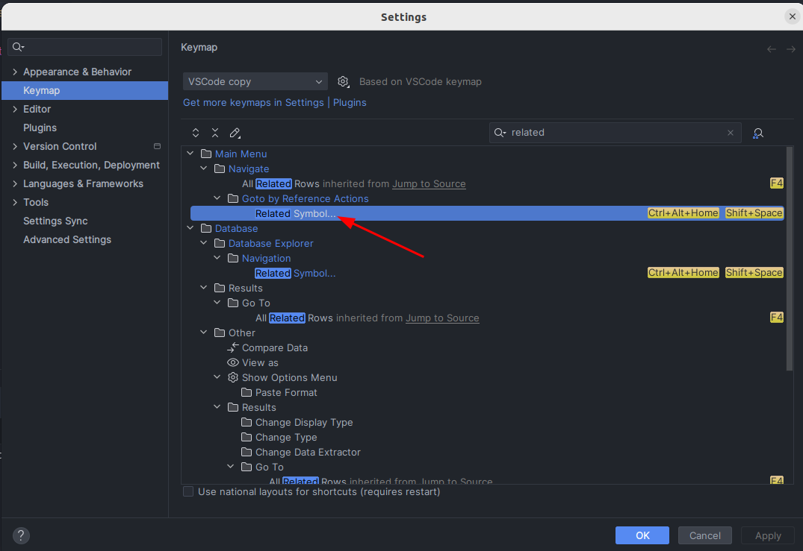
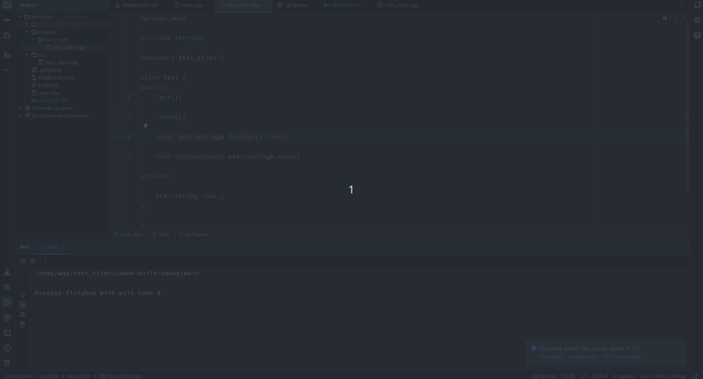
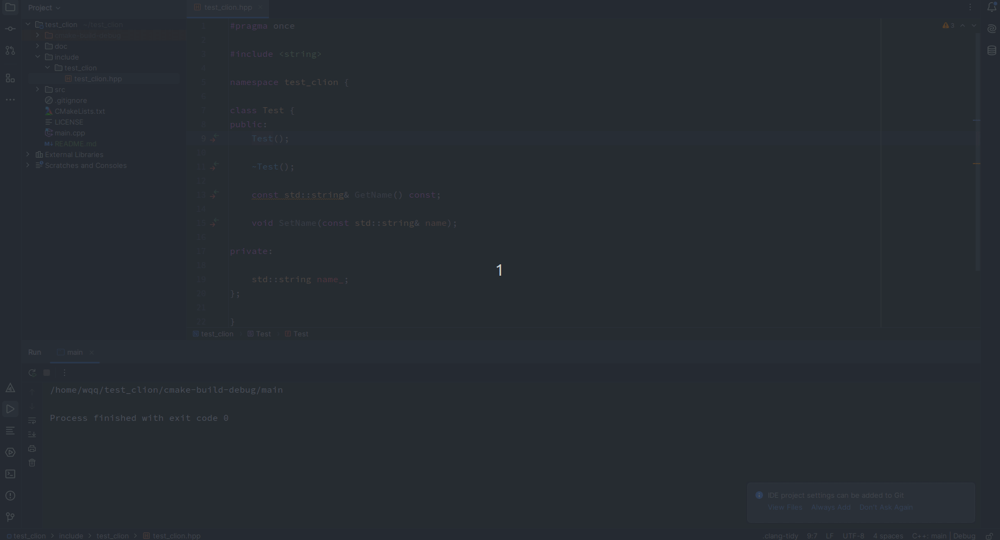

## Report the bug of CLion 2024.3's Navigate | Related Symbol is not working

Report this bug in https://youtrack.jetbrains.com/issue/CPP-42784/CLion-2024.3s-Navigate-Related-Symbol-is-not-working

## The keyboard shortcut of `Navigate | Related Symbol` is as shown.



## Clion with version 2024.1.6 
```
CLion 2024.1.6
Build #CL-241.19416.21, built on October 17, 2024
Licensed to qiqi wu
You have a perpetual fallback license for this version.
Subscription is active until August 15, 2025.
Runtime version: 17.0.12+1-b1207.37 amd64
VM: OpenJDK 64-Bit Server VM by JetBrains s.r.o.
Linux 6.8.0-49-generic
GC: G1 Young Generation, G1 Old Generation
Memory: 4004M
Cores: 16
Registry:
actionSystem.update.actions.warn.dataRules.on.edt=false
debugger.attach.dialog.enabled=true
run.processes.with.pty=TRUE
ide.experimental.ui=true
ide.slow.operations.assertion=false
Non-Bundled Plugins:
com.markskelton.one-dark-theme (5.12.0)
com.intellij.plugins.vscodekeymap (241.14494.150)
Current Desktop: ubuntu:GNOME
```

The GIF picture here records the screen when the Related Symbol works.



## CLion 2024.2.4 ~ 2024.3.3.1 are not working.

Here I list the info of clion with version 2024.2.4.
```
CLion 2024.1.6
Build #CL-241.19416.21, built on October 17, 2024
Licensed to qiqi wu
You have a perpetual fallback license for this version.
Subscription is active until August 15, 2025.
Runtime version: 17.0.12+1-b1207.37 amd64
VM: OpenJDK 64-Bit Server VM by JetBrains s.r.o.
Linux 6.8.0-49-generic
GC: G1 Young Generation, G1 Old Generation
Memory: 4004M
Cores: 16
Registry:
  actionSystem.update.actions.warn.dataRules.on.edt=false
  debugger.attach.dialog.enabled=true
  run.processes.with.pty=TRUE
  ide.experimental.ui=true
  ide.slow.operations.assertion=false
Non-Bundled Plugins:
  com.markskelton.one-dark-theme (5.12.0)
  com.intellij.plugins.vscodekeymap (241.14494.150)
Current Desktop: ubuntu:GNOME

```

The GIF picture here records the screen when the Related Symbol not works.



